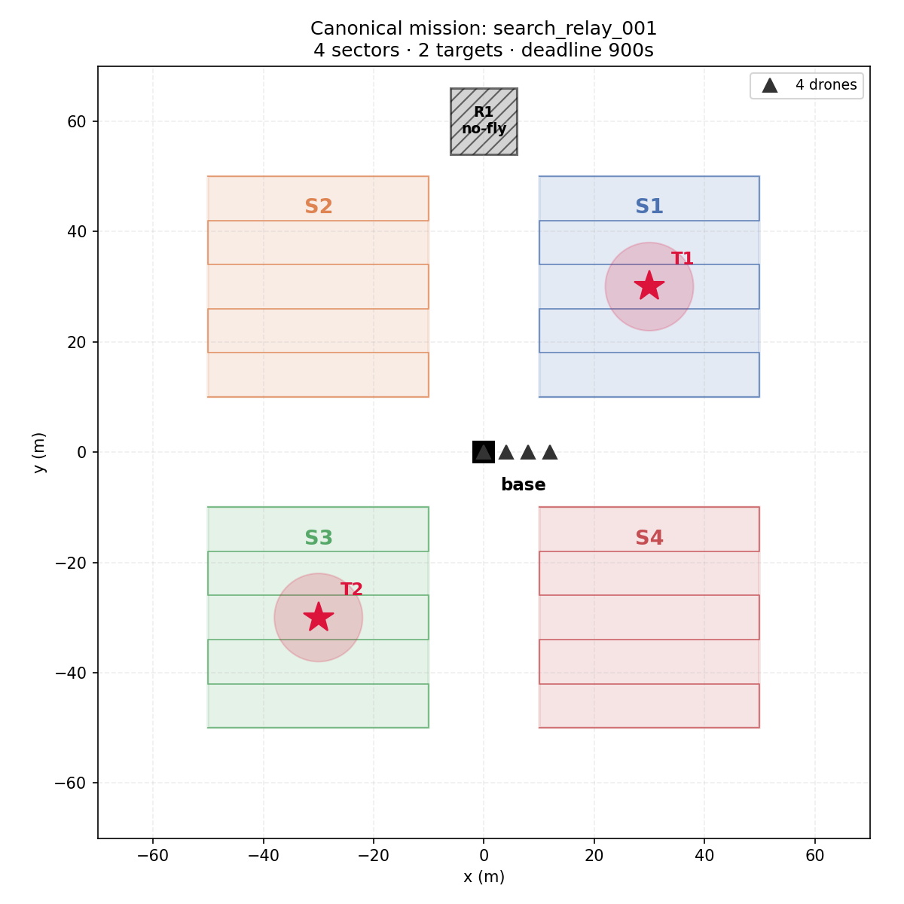

<h1 align="center">FICSAgenticDroneSim</h1>

<p align="center">
  <b>A multi-agent UAV simulation framework for decentralized, persistent drone agents.</b><br>
  Built in the <a href="https://faculty.erau.edu/">FICS Lab</a> at Embry-Riddle Aeronautical University
  &nbsp;·&nbsp; PI: Dr. M. Ilhan Akbas
</p>

<!-- ===================== IMAGE 1: HERO ======================================
     Best single frame from a demo video: 4 drones airborne over Town10HD,
     ideally mid-sweep with the CARLA-Air window visible. Wide crop (~16:9).
     Save as: docs/images/hero_fleet.png
========================================================================== -->
<!-- TODO screenshot: docs/images/hero_fleet.png -- Four agents flying the canonical search-and-relay mission in CARLA-Air. -->

---

## What this is

An operator gives a drone team a goal. Each drone runs as a **persistent agent**
with its own local belief state, decides one skill at a time in a closed loop,
and flies it in a CARLA-Air / AirSim simulation.

The research question this is built toward: *does a decentralized team of
persistent agents — using local beliefs, structured peer communication, dynamic
task allocation and bounded replanning — maintain greater mission continuity
under communication degradation and agent loss than centralized planning or
independent non-coordinating agents?*

Everything runs **deterministically on a mock simulator** as well, so the full
test suite needs no simulator, no GPU and no LLM.

<!-- ===================== IMAGE 2: SYSTEM DIAGRAM ============================
     Optional but high value. A simple block diagram:
       Operator/Task -> Policy -> Guardian -> SkillExecutor -> VehicleAdapter
                          ^                                        |
                       Belief <---- SensorModel <---- GroundTruth --+
     Draw in draw.io / Excalidraw and export PNG.
     Save as: docs/images/architecture.png
========================================================================== -->
<!-- TODO screenshot: docs/images/architecture.png -- The agent decision path. Ground truth reaches belief only through the sensor. -->

---

## Quick start

No simulator required:

```bash
pip install -r requirements.txt

python scripts/run_canonical_mission.py     # full 4-drone mission, scored
python scripts/run_persistent_agent.py --log # one closed-loop agent + audit trail
```

Fly it for real (CARLA-Air running on ports 2000 / 41451):

```bash
python scripts/run_canonical_mission.py --airsim
python scripts/run_persistent_agent.py --airsim
```

Verify everything in one command:

```bash
python scripts/run_all_tests.py     # 295 tests + 15 demos
```

See **[docs/TESTING.md](docs/TESTING.md)** for how to verify each phase
individually, what the output should look like, and how to deliberately break
things to confirm the checks are real.

---

## The two interfaces everything is built around

- **`MissionPlanner`** (`agentic_uav/planners/base_planner.py`)
  `decide(context: AgentContext) -> AgentDecision`.
  Implemented by Gemini, Llama, Mistral and a deterministic rule policy — the
  agent doesn't know or care which it holds.

- **`VehicleAdapter`** (`agentic_uav/core/models.py`)
  navigation primitives + state. Agents never call AirSim directly. Implemented
  by `AirSimVehicleAdapter` (real sim) and `MockVehicleAdapter` (kinematic, no sim).

---

## Layout

```
agentic_uav/
  core/          data types, enums, geometry, mission models
  simulator/     adapters (airsim, mock), scenario loader,
                 ground truth + sensor model, target detection
  control/       skills + contracts, skill executor, navigation constants
  agents/        persistent agent, belief state + schema, policy, guardian
  coordination/  message protocol + bus, tasks, bidding, allocation,
                 roles + health, seeded network degradation model
  planners/      MissionPlanner interface + gemini/llama/mistral/rule
  experiments/   mission runner, metrics, decision log, logging
configs/
  missions/      canonical scenario definitions (YAML)
  experiments/   one YAML per experiment run (Phase 14)
scripts/           runnable demos, one per phase
tests/             295 tests, all runnable without a simulator
docs/
```

---

## Phase 3 — High-level skills

The agent's interface is mission-oriented skills, not directional commands. Each
skill has a typed command and a **formal contract** (preconditions,
success/failure conditions, timeout, abort behavior, expected state change), and
returns a structured `SkillResult` (`success | failed | aborted | timeout`, with
timing, final position and error code).

`TAKE_OFF` · `GO_TO_WAYPOINT` · `FOLLOW_WAYPOINTS` · `SEARCH_REGION` ·
`INSPECT_POINT` · `HOLD_POSITION` · `RENDEZVOUS` · `ACT_AS_RELAY` ·
`RETURN_HOME` · `LAND` · `EMERGENCY_HOLD`

<!-- ===================== IMAGE 3: MULTI-DRONE SKILL DEMO ====================
     Frame from the Phase 3 demo video: 4 drones holding at distinct waypoints
     (the formation moment reads best). Save as: docs/images/phase3_skills.png
========================================================================== -->
<!-- TODO screenshot: docs/images/phase3_skills.png -- Four drones executing take-off, waypoint, hold, return and land concurrently. -->

```bash
python scripts/phase3_demo.py                  # deterministic, on the mock
python scripts/phase3_demo.py --adapter airsim # fly it for real
python scripts/phase3_showcase.py              # all 11 skills
```

---

## Phase 4 — The canonical mission

One fixed scenario, `configs/missions/search_relay_001.yaml`, is the world every
later experiment runs against: a base station, four rectangular search sectors,
two targets, a restricted no-fly region, four drones with a battery budget, a
comms/relay range and a mission deadline. It is declarative, so the scenario
stays stable while the coordination architecture changes around it.

<!-- ===================== IMAGE 4: MISSION LAYOUT ============================
     Either (a) a top-down screenshot of the sim showing the sweep pattern, or
     (b) a simple 2D plot of the four sectors + targets + no-fly zone.
     A matplotlib plot of the scenario reads very clearly here.
     Save as: docs/images/mission_layout.png
========================================================================== -->
<p align="center">
  
  <br><em>The canonical scenario: four search sectors, two targets, one no-fly zone.</em>
</p>

- **Simulated detection** (`simulator/target_model.py`) is purely geometric — a
  target is found when a drone's path stays inside its detection radius long
  enough. Deliberately **no neural network**, so a mission failure is
  attributable to coordination, communication or control, never to perception.
- **Mission evaluation** (`experiments/metrics.py`) scores a run against every
  success criterion: sector coverage, targets detected *and reported to base*,
  no restricted-zone entry, no separation violation, battery and deadline
  respected, all drones returned safely.
- **Baseline** — a fully scripted, *non-agentic* controller
  (`experiments/mission_runner.py`) completes the mission. That is the bar the
  coordinated architecture has to beat.

<!-- ===================== IMAGE 5: MISSION REPORT ============================
     Terminal screenshot of `python scripts/run_canonical_mission.py` showing
     the criteria list with all PASS lines and MISSION SUCCESS.
     Use a dark terminal, crop tight. Save as: docs/images/mission_report.png
========================================================================== -->
<!-- TODO screenshot: docs/images/mission_report.png -- Scored mission output — 100% coverage, both targets found and reported. -->

```bash
python scripts/run_canonical_mission.py
```

---

## Phase 5 — Persistent closed-loop agent

Instead of planning a mission up front, a drone runs a persistent loop:

```
observe → update belief → select objective → choose skill
        → validate → execute → verify
```

It receives a **task** ("search sector S1 and report"), *not* an action list, and
decides one skill at a time. Replanning is **event-driven**: it re-decides only
when something happens — a skill finished, a target was seen, the battery crossed
a threshold, a safety guard fired — never in a busy loop, so low-level motion
never waits on the decision layer.

A deterministic policy (`agents/search_policy.py`) is built first, ahead of any
LLM, as both a debugging tool and a research baseline. A separate `Guardian`
(`agents/guardian.py`) gets the last word on every command, so an unsafe action
never reaches the vehicle — and the LLM policy later is held to the same rules
without being trusted to enforce them.

It accepts a task, navigates to and searches its sector, reports, returns home,
**reacts to low battery** (lands safely rather than extending the mission) and
**recovers from a failed navigation skill** (retries, then gives up safely).

<!-- ===================== IMAGE 6: DECISION TRACE ============================
     Terminal screenshot of `python scripts/run_persistent_agent.py` showing the
     decision trace (event -> objective lines) and TASK COMPLETE.
     Save as: docs/images/agent_decision_trace.png
========================================================================== -->
<!-- TODO screenshot: docs/images/agent_decision_trace.png -- The agent deciding one skill at a time — no preflight plan. -->

```bash
python scripts/run_persistent_agent.py             # completes the task
python scripts/run_persistent_agent.py --battery 8 # low-battery safe abort
```

---

## Phase 6 — Structured belief state

Each drone's memory is an explicit typed structure (`agents/belief_schema.py`),
**not** an LLM conversation transcript — so any decision can be queried and
audited afterwards. Sections: `self`, `mission`, `local_map`, `team`,
`communication`, `assumptions`.

**Truth is separated from belief.** `simulator/ground_truth.py` holds the true
world state, for the simulator and evaluator only. The single bridge into an
agent is a `SensorModel`, returning just what that drone could actually perceive
from where it flew. An agent never holds a scenario, a target list or a
ground-truth object — otherwise a "decentralized" experiment would quietly be
running on perfect global information. Two tests enforce this: one walks the
belief's object graph looking for smuggled truth objects, the other checks
behaviorally that a target in an unsearched sector is never learned about.

**Beliefs age.** Every teammate record carries a timestamp, source, confidence
and expiry, and confidence decays with age — so a stale position report is never
mistaken for a current one.

<!-- ===================== IMAGE 7: BELIEF AUDIT TRAIL ========================
     Terminal screenshot of `python scripts/run_persistent_agent.py --log`
     showing a couple of steps with KNEW / DID NOT KNOW / DECIDED.
     This is the Phase 6 exit criterion — worth showing clearly.
     Save as: docs/images/belief_audit_trail.png
========================================================================== -->
<!-- TODO screenshot: docs/images/belief_audit_trail.png -- Every decision logged with what the agent knew — and what it didn't. -->

```bash
python scripts/run_persistent_agent.py --log
python scripts/run_persistent_agent.py --log --log-json run.json
```

---

## Phase 7 — Inter-agent message protocol

Four agents now fly the mission **together**, exchanging messages over a shared
bus. Communication here is deliberately *perfect* (no latency, no loss);
degradation is added only once the protocol is known to work.

Thirteen message types share one envelope (`coordination/protocols.py`) carrying
id, type, sender, recipients, mission, timestamp, sequence number, TTL, payload
and confidence — so ordering, expiry, addressing and logging are implemented once
rather than per message type.

**No hidden global communication.** The bus is central simulation
infrastructure, but agents never hold one. Each holds an `AgentLink` exposing
exactly two methods — `send()` and `receive_available()` — so an agent cannot
enumerate peers, read another inbox, see what is still in flight, or inspect what
was dropped. The strongest check of this is a blackout test: with a bus that
delivers nothing, no agent may learn *anything* about a teammate, even though all
four are flying the same mission simultaneously.

Agents are interleaved by simulated clock (whoever is furthest behind steps
next), so messages genuinely flow mid-flight rather than after the fact, and the
whole run stays deterministic.

<!-- ===================== IMAGE 8: TEAM MESSAGING ============================
     Terminal screenshot of `python scripts/run_team_mission.py` showing all four
     drones COMPLETE and the message stats / by-type breakdown.
     Save as: docs/images/team_messaging.png
========================================================================== -->
<!-- TODO screenshot: docs/images/team_messaging.png -- Four agents coordinating over the message bus under perfect communication. -->

Every message is logged with creation time, scheduled and actual delivery,
delivered/dropped status (link loss and TTL expiry counted separately), sender,
recipient, size, expiry, and **whether it influenced a decision**.

```bash
python scripts/run_team_mission.py             # 4 agents, full mission
python scripts/run_team_mission.py --messages  # per-message delivery log
python scripts/run_team_mission.py --beliefs   # each agent's team belief
```

---

## Phase 8 — Decentralized task allocation

The team is given a **mission**, not an assignment. Who searches which sector is
decided entirely by a contract-net protocol running independently on every
drone — announce, bid, claim, acknowledge, report progress — with no auctioneer
and no central planner. This is deliberately built *before* any LLM
decision-making, so later we can tell whether an improvement came from the
multi-agent protocol or from the model.

**Bids are deterministic and transparent** (`coordination/bidding.py`):

```
Bid(i,k) = w_d·distance + w_b·battery + w_l·workload + w_c·comms-risk + w_r·role-mismatch
```

Lowest bid wins, ties break on vehicle ID, and every bid carries its
term-by-term breakdown — so you can see *why* a drone won a sector, not just
that it did.

**Leases make recovery automatic** (`coordination/tasks.py`). A claim is not
permanent: the holder must keep reporting progress. Go silent and the lease
expires, the task is announced again, and a teammate picks it up.

**Conflicts resolve deterministically** (`coordination/task_allocator.py`).
When latency makes two drones claim the same sector, the rules are: higher task
version, then lower bid, then lower vehicle ID; the loser releases and every
correction is logged. Task versions are a **Lamport clock**, not a local
counter — otherwise two agents' version numbers would be unrelated and the first
rule would do the wrong thing.

```bash
python scripts/run_allocation_mission.py             # 4 drones divide the work
python scripts/run_allocation_mission.py --bids      # every bid, explained
python scripts/run_allocation_mission.py --conflicts # duplicate-claim resolutions
python scripts/run_allocation_mission.py --lease 1   # force lease expiry + recovery
```

Exit criterion: four drones receive one mission, divide the sectors with no
central assignment, complete the work, and converge on a single holder per task —
verified at 0s, 20s and 60s of message latency, where 40+ simultaneous claims
occur and all of them resolve.

---

## Phase 9 — Dynamic roles and failure recovery

Allocation decides *what* each drone is doing. A **role** decides what it is
*for*: `SCOUT` (searches), `RELAY` (holds station to keep the team in contact),
`RESERVE` (available for failed or high-priority work). Every agent picks its own
role from local belief, so the team's shape changes without anything assigning
it. A RELAY simply drops the `search` capability, so the existing bidding check
stops handing it sectors — no special case in the allocator.

**Failure detection is deliberately graded.** A missed heartbeat means "I have
not heard from you", which is not the same as "you have crashed":

```
HEALTHY → SUSPECTED → UNREACHABLE → FAILED        (silence lengthens)
                   ↘ RECOVERED                     (it speaks again)
```

Declaring failure on one missed message would be worse than not detecting
failure at all — sectors would be yanked off healthy drones that were briefly
quiet. A test asserts exactly that restraint.

**Recovery short-circuits the lease.** The lease has to be *longer* than the
longest skill, or a drone busy inside a 70 s sweep gets its sector stolen. But
waiting out a 150 s lease for a drone the team already knows is gone would waste
most of the mission — so a task whose holder is believed failed becomes
available immediately.

<!-- ===================== IMAGE 9: FAILURE RECOVERY ==========================
     Terminal screenshot of `python scripts/run_failure_recovery.py` showing the
     kill, who detected it, and the reassigned sector.
     Save as: docs/images/failure_recovery.png
========================================================================== -->
<!-- TODO screenshot: docs/images/failure_recovery.png -- Drone2 stopped at t=15s. The team notices, reassigns its sector, and finishes. -->

Exit criterion — one of four drones is switched off mid-mission (no flight, no
sensing, no heartbeats, nobody told). The rest detect the silence, reclaim its
sector and complete the mission with **zero human commands after launch**:

```bash
python scripts/run_failure_recovery.py              # kill Drone2 at t=5s
python scripts/run_failure_recovery.py --health     # health state transitions
python scripts/run_failure_recovery.py --roles      # role changes
python scripts/run_failure_recovery.py --kill Drone3 --at 40
```

```
!! Drone2 switched off at t=15s (teammates not informed)
detected the loss : Drone3:unreachable, Drone4:failed
sectors completed : 4/4
  SEARCH_SECTOR_S2     by Drone4  <- reassigned after the failure
human commands after launch: 0
```

**Controlled emergence**, checked as assertions rather than claimed: the operator
gives a team-level objective; no central controller specifies any drone's task
sequence; agents use only local beliefs and delivered messages (verified by
scanning each belief for ground-truth objects); allocation and role changes come
from agent interaction; and deterministic constraints still hold — every
surviving drone lands safely at home.

---

## Phase 10 — Degraded communications

Phase 7 proved the protocol under *perfect* communication. This is where it gets
tested honestly. A seeded `NetworkModel` (`coordination/network_model.py`)
provides latency mean/jitter, packet loss, rate limits, bandwidth caps,
communication range, burst loss, partitions, interference zones and asymmetric
links, with four named conditions:

| condition | latency | loss | other |
|---|---|---|---|
| `nominal` | 20±5 ms | 0% | — |
| `moderate` | 150±50 ms | 10% | — |
| `severe` | 600±250 ms | 30% | 4 msg/s rate limit, 5% burst loss |
| `partitioned` | 100±30 ms | 5% | two groups split for a window |

**These are experimental parameters, not a model of any real radio.** They exist
so architectures can be compared under identical conditions.

**Seeded.** Same seed → the same messages lost, the same latencies drawn. That is
what makes "under the same degraded conditions" a meaningful claim.

**Agents estimate, never read.** An agent cannot see the configured loss rate; it
infers link quality from missing sequence numbers, heartbeat arrival rate,
message age on arrival, and whether anything is arriving at all
(`agents/comms_estimator.py`). Tests confirm no network object is reachable from
an estimator, and that agents independently estimate higher loss under `severe`.

**Verified statistically** (`tests/test_network.py`, 30 tests): thousands of
messages per check confirm empirical loss and latency match what was configured,
partitions block only the intended links, expired messages never arrive, and
identical seeds reproduce identically.

```bash
python scripts/run_comms_study.py              # all four conditions
python scripts/run_comms_study.py --estimates  # agents' own view of the link
python scripts/run_comms_study.py --condition severe --messages
```

```
condition      sectors   sent  deliv   rate    delay  drops
nominal          4/4      315    303   96%   10.35s  none
moderate         4/4      282    240   85%   21.13s  packet_loss=32
severe           4/4      744     99   13%   31.09s  rate_limited=568, packet_loss=63, burst=11
partitioned      4/4      426    289   68%   16.01s  partitioned=108, packet_loss=15
```

---

## Phase 11 — An independent runtime-safety guardian

Every phase so far trusted the policy. This one stops. A deterministic safety
layer (`agents/safety_guardian.py`) sits between *whatever proposed a command*
and the vehicle, so a buggy rule policy, a future LLM policy, a corrupt message
or a unit-confusion error cannot fly the drone somewhere it should not go.

**No model inside it.** No learned component, no randomness. Same command plus
same belief always gives the same verdict, and it can always name which check
failed and why. A guardrail built as a second language model would inherit
exactly the failure modes it exists to contain.

**Ten named checks** — `altitude_bounds`, `geofence`, `restricted_zones`,
`waypoint_validity`, `max_speed`, `command_timeout`, `battery_reserve`,
`separation`, `landing_site`, `conflicting_commands`.

**Four outcomes.** A violation that can be *narrowed* into the envelope is
narrowed (120 m/s → 12 m/s); one that cannot be (`NaN` waypoint, no-fly zone) is
refused. The guardian may never invent work — when it substitutes, it substitutes
one of five pre-agreed fallbacks: hold, climb/descend to the safe layer, return
home, land at a safe location, continue the last valid plan.

**Attacked, not assumed.** `agents/unsafe_injection.py` is a catalogue of 13
commands a compromised policy could plausibly emit, each paired with the check
that must catch it, plus an `InjectingPolicy` that substitutes unsafe commands
into a live mission so containment is observable end to end.

**Containment is not safety.** With `--repeat`, the policy stays broken for the
whole mission. Every unsafe command was blocked — and the drone still never came
down: `REJECT_AND_REPLAN` assumes the policy can do better next time, and a
permanently broken one never does. The guardian now escalates after a bounded
number of failures and flies the aircraft home itself. The first version of that
counter was evadable — alternating a rejectable command with a clampable one
resets it every other step — so the counter that governs escalation resets only
on a command that passed every check untouched. The broken run now ends in 8
commands with the drone landed, instead of 60 with it still flying.

**It found a real flight bug.** The guardian flagged a *legitimate*
`return_home` — correctly. The policy was targeting home at `z = 0`, making the
drone descend while translating across the map instead of flying home at cruise
altitude and landing separately. Six phases of the mock adapter had been
forgiving it.

```bash
python scripts/run_guardian_demo.py                  # catalogue; nothing flies
python scripts/run_guardian_demo.py --live           # + compromised-policy mission
python scripts/run_guardian_demo.py --live --repeat  # policy never recovers
```

```
  blocked 13/13 (all unsafe commands stopped)

  commands evaluated : 7      approved unchanged : 4
  interventions      : 3 (43% of commands)
  by outcome         : approve 4 · approve_with_modification 1 · reject_and_replan 2

  unsafe commands that reached the vehicle: 0
  drone landed safely at home: True
```

The headline metric is **intervention rate** — the fraction of proposed commands
not passed through unchanged. On a healthy policy it is ~0; on an LLM policy it
becomes a direct measurement of how often that policy proposes something
unflyable.

---

## Phase 12 — The LLM as a persistent agent policy

Eleven phases built a decentralized team that works without a model. Now the
model goes *inside* each agent, without giving back any of the safety properties
bought along the way.

**It goes in the policy slot, not the control path.** `LLMAgentPolicy` implements
the same two methods as the deterministic Phase 5 policy, so the agent loop, the
allocator, the message bus and the Phase 11 guardian are **unchanged**. None of
them know a model is involved.

**One model process, four agents.** A backend holds no conversation, so a single
Ollama process serves every drone. What stays separate is what the research needs
separate: identity, belief, task, memory, inbox, decision history.

**Fifteen tools, nothing else.** The model selects one by name with schema-checked
parameters. It does not write Python, call AirSim, or hand the executor a path of
its own invention. Unknown parameters are an error, not something to ignore.

**A structured decision, no chain of thought.** Three enum fields, one tool, its
parameters, bounded messages, a confidence and a short `reason_code`. Twelve
reason codes can be counted across a thousand decisions; a thousand paragraphs of
rationale cannot.

**The model never does arithmetic.** Seven deterministic calculators — distance,
travel time, sweep time, battery, comms, task cost, route feasibility, separation
— are computed in Python and handed over with the context.

> the model chooses **what to do and why**; the code computes **whether it is possible**

**Every failure path flies the aircraft.** One correction that names the specific
fault, then the deterministic policy takes over, and the event is recorded. Take-off,
landing, low battery and end-of-mission are never delegated — they are facts, not
judgements.

**It runs with no model installed.** `ScriptedBackend` is the `fake_airsim` of
Phase 12, so all 60 tests are deterministic and need no GPU or API key.

```bash
python scripts/run_llm_agents.py                      # scripted, no install
python scripts/run_llm_agents.py --failures --unsafe  # the failure catalogue
python scripts/run_llm_agents.py --backend ollama --model llama3.1:8b --save runs/
```

```
  agents    : 4 (4 distinct policy objects, 1 shared backend)
  sectors searched : 4/4      all landed : True
  team: 31 decisions, 14 fallback (45%), 0 corrected
  guardian interventions: 0
```

**Phase 12 found four bugs, three older than itself.** The model had no way to
land, so it hovered over its own pad 60 times. The mock simulator had been
starting every drone at the origin, ignoring the per-vehicle pads the scenario
declares — which meant **Phase 8's bids were all numerically identical**, and the
"decentralized division of work" was really the tie-breaker. Fixing that exposed
a deadlock (a drone that claims a task leaves its stale bids on *other* tasks,
which still win but can no longer be claimed) and a drone that ended its loop
mid-air after losing every bid. The guardian, separately, had been sending every
escalating drone to the same shared base coordinate.

**The number to watch is the fallback rate** — how much of a reported "LLM agent"
result is the rule agent in a costume.

---

## Phase 13 — The comparison architectures

A paper cannot compare "old code" against "new code" — too much changes at once.
Five architectures, each differing from its neighbours on exactly one axis, all
built by one function from one spec.

| | architecture | isolates |
|---|---|---|
| **A** | Centralized fleet controller | centralized vs decentralized |
| **B** | Independent persistent agents | the value of coordinating at all |
| **C** | Deterministic decentralized | architecture, without an LLM |
| **D** | Agentic decentralized | the contribution of LLM reasoning |
| **E** | Open-loop preflight | historical context |

Plus six ablations, each one `replace()`d from its parent so it cannot
accidentally differ twice. Selecting an architecture is a config change:

```bash
python scripts/run_experiment.py --condition nominal severe --kill Drone2@1
python scripts/run_experiment.py --ablations --seeds 17 18 19 --save runs/
```

**The tests here are validity tests, not functional ones.** A functional bug
makes a run crash; a validity bug makes every run succeed and every number mean
something else. They assert identical scenario, guardian limits, executor and
network profile across all five — and that **D with the LLM disabled reproduces
C**, which is the strongest single check that the C-vs-D axis is clean.

**Two findings mattered more than the code.**

*The canonical scenario cannot discriminate.* Four drones, four sectors, no
faults — every architecture scores 1.00 coverage in 112 s, including the one
that never coordinates. B is optimal by construction when work is pre-partitioned
and nothing fails. Coordination only has something to do once a drone is lost, so
fault injection is part of the experiment rather than a stress test.

*The recovery mechanisms were slower than the mission.* At the demo default of a
20 s heartbeat a peer is not declared failed for 160 s, and the lease is 120 s —
but a run lasts 112 s. No architecture could reclaim a lost drone's work, so a
comparison at those settings would have reported "decentralized coordination
does not recover", which is false. Caught only because C and D disagreed when
they cannot. The runner now warns whenever detection outlasts a typical run.

---

## Phase 14 — Experiment runner and complete logging

One YAML config describes one run. Every run writes a manifest (git SHA,
config, seed, model card, software versions, timing, completion status), a
JSON Lines stream of all 19 event types, the metrics, and the LLM transcripts.

```bash
python scripts/run_batch.py configs/experiments/sweep_architectures.yaml
python scripts/run_batch.py configs/experiments/ --repeat 5 --out results/
```

**Failed runs are preserved** — the directory is created first, the manifest is
written before the mission, and events are flushed in a `finally` block. A crash
part-way through is often the most informative run in a batch; losing its events
destroys the evidence.

Events are tagged `live` or `derived:<log>`. Deriving from the existing
component logs avoids threading an event sink through twelve phases of tested
code, and a test asserts the derived message events match the bus log exactly.

**A mistake worth recording:** this phase overwrote the Phase 1-2 `run_mission`,
which `test_behavior_preservation.py` depends on. It was restored from a
pre-Phase-13 copy of the tree and re-verified against the action sequences that
test has pinned since Phase 2. The reconstruction attempted first passed that
test while being semantically wrong: the original plans *every* drone before any
of them flies, and the reconstruction planned inside each worker thread — a
difference a single-drone sequential test cannot see. The test earned its keep,
and also showed its limit.

---

## Testing

295 tests, none of which need a simulator, GPU or API key.

| Suite | Tests | Covers |
|---|---|---|
| `test_skills.py` | 12 | skill contracts, tolerances, timeouts, 4-drone concurrency |
| `test_behavior_preservation.py` | 4 | refactor preserved the original flight behavior |
| `test_mission.py` | 6 | mission scoring + negative tests for each failure mode |
| `test_persistent_agent.py` | 5 | closed loop, low battery, navigation recovery |
| `test_belief_state.py` | 11 | belief schema, ground-truth leaks, staleness, decision log |
| `test_messaging.py` | 14 | envelope, addressing, bus containment, logging, 4-agent run |
| `test_allocation.py` | 21 | tasks, bidding, leases, conflict rules, self-organizing division |
| `test_roles_recovery.py` | 22 | roles, health states, failure detection, recovery |
| `test_network.py` | 30 | network model verified statistically; seeded replay |
| `test_guardian.py` | 45 | every check, every outcome, every fallback, 13 unsafe commands, escalation |
| `test_llm_policy.py` | 60 | tools, schema, bounded context, fallback chain, per-agent isolation |
| `test_architectures.py` | 23 | the five architectures are comparable and differ on one axis each |
| `test_experiment_runner.py` | 25 | configs, manifests, the event stream, and that failed runs survive |
| `test_airsim_path.py` | 17 | the AirSim code path, against a fake simulator |

---

## Documentation

- **[`docs/Phase_Documentation.md`](docs/Phase_Documentation.md)** — the arc of the
  project, phase by phase, with what each one proved and what it cost.
- **[`docs/TESTING.md`](docs/TESTING.md)** — how to verify every phase
  individually, what correct output looks like, and how to break each invariant
  on purpose to confirm the checks are real.
- **[`docs/SIM_TESTING.md`](docs/SIM_TESTING.md)** — flying Phases 3–7 in
  CARLA-Air for real: environment setup, pinned versions, the port layout, and
  the known failure modes when the simulator is involved.
- **[`docs/ARCHITECTURE.md`](docs/ARCHITECTURE.md)** — module-by-module design,
  and the two interfaces (`MissionPlanner`, `VehicleAdapter`) everything else is
  written against.

Reproducibility specifics — pinned versions, the CARLA-Air port layout, and
running Llama / Mistral locally through Ollama — live in `docs/SIM_TESTING.md`
rather than in separate top-level files.

---

<sub>FICS Lab · Embry-Riddle Aeronautical University · Research direction by Dr. M. Ilhan Akbas</sub>
